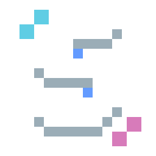
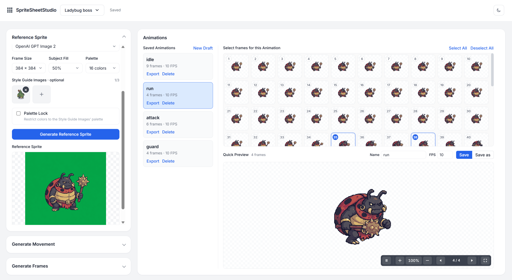

<p align="center"></p>

# SpriteSheetStudio

A local web app for creating 2D game Animations from generated or uploaded Reference Sprites.

SpriteSheetStudio uses OpenRouter for image and video generation. It extracts transparent Movement Frames locally with ffmpeg, then creates spritesheets and looping previews. Projects autosave to gitignored UUID workspaces under `projects/`.

SpriteSheetStudio began as a fork of [acatovic/ai-game-studio](https://github.com/acatovic/ai-game-studio). It has since diverged substantially, with a redesigned workflow, architecture, interface, and project model.



## Requirements

- Node.js 22.22.2+
- pnpm 11 (enable it with Corepack if needed)
- `ffmpeg` on `PATH`
- An OpenRouter API key for generation

Uploads and local frame processing do not require an API key.

## Setup

```bash
pnpm install
cp .env.example .env
# Add OPENROUTER_API_KEY to .env
pnpm dev
```

Open <http://localhost:5173>.

## Workflow

1. Generate or upload a Reference Sprite.
2. Choose a video model and generate movement video.
3. Configure extraction and generate transparent Movement Frames.
4. Select frames, set the name and FPS, then save the Animation.
5. Preview, update, export, or delete saved Animations.

Projects can be created, switched, renamed, and deleted from the header.

## Commands

```bash
pnpm dev
pnpm test
pnpm build
```

Generated artifacts, videos, and local environment files are ignored by Git. See [AGENTS.md](AGENTS.md) for contributor guidance and [CONTEXT.md](CONTEXT.md) for domain terminology.
